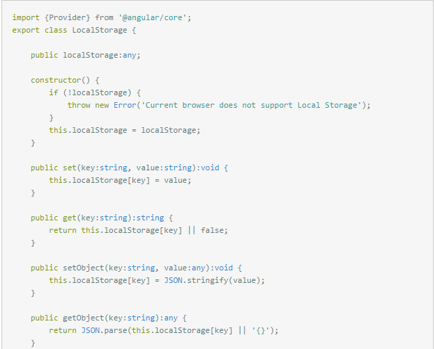

### 本地储存LocalStorage
1. 首先新建一个文件local-storage.ts，随意放置。
2. localStorage：使用时可以不用添加,因为他是window的方法可以直接使用.let ls = window.localStorage;
然后使用localStorage的用法。
<!--
-->
```
    import {Provider} from '@angular/core'; 
    export class LocalStorage {
        public localStorage:any;
        constructor() {
            if (!localStorage) {
                throw new Error('Current browser does not support Local Storage');
            }
            this.localStorage = localStorage;
        }
        public set(key:string, value:string):void {
            this.localStorage[key] = value;
        }
        public get(key:string):string {
            return this.localStorage[key] || false;
        }
        public setObject(key:string, value:any):void {
            this.localStorage[key] = JSON.stringify(value);
        }
        public getObject(key:string):any {
            return JSON.parse(this.localStorage[key] || '{}');
        }
        public remove(key:string):any {
            this.localStorage.removeItem(key);
        }
    }
    // export const LOCAL_STORAGE_PROVIDERS:any[] = [
    //         Provider(LocalStorage, {useClass: LocalStorage})
    // ];
```
2. 在跟模块app.module中引入import这个文件 --providers:[LocalStorage]
3. 在需要使用的组件中引入这个文件。
4. 使用时先new 一个实例才能使用。
```
    **.component.ts中
    import { LocalStorage } from '../local.storage';
    localstorage = new LocalStorage();
    点击事件//保存的值是全局的，任意页面引入localstorage之后都能取出来
    submit(){
    let people = this.pObj;
    let ls = this.localstorage;
    ls.set('password',people.pass)
    console.log(ls.get('password'));//取到password的value.
     }
```
5. localstorage一共有保存、取值、删除某一个、删除全部、保存对象、删除对象，这些方法，可以在文件local-storage.ts中添加方法。

